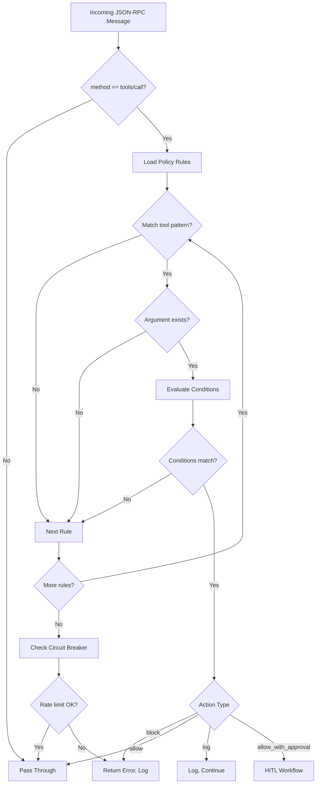

# MCP Sentinel - Architecture & Planning

## Overview

MCP Sentinel is a runtime security gateway for Agentic AI systems using the Model Context Protocol (MCP). It acts as a transparent Man-in-the-Middle proxy that intercepts JSON-RPC messages between LLM clients (e.g., Claude Desktop) and MCP servers (tools), enforcing security policies in real-time.

## Goals

1. **Prevent Data Exfiltration** - Block unbounded queries (e.g., `SELECT *` without `LIMIT`)
2. **Rate Limiting** - Circuit breaker to prevent infinite loops and excessive API calls
3. **Human-in-the-Loop** - Pause critical actions (DELETE, DROP) for manual approval
4. **Audit Trail** - Log all blocked requests for security analysis
5. **Zero-Config Deployment** - Drop-in replacement for MCP server commands

## Architecture

### Threading Model

```
┌─────────────────┐         ┌──────────────────┐         ┌─────────────────┐
│  Claude Desktop │◄───────►│  Gateway Process │◄───────►│   MCP Server    │
│    (Client)     │  stdio  │   (Sentinel)     │  stdio  │ (sqlite-mcp)    │
└─────────────────┘         └──────────────────┘         └─────────────────┘
```

**Threads:**
- **Main Thread**: Subprocess lifecycle management, signal handling
- **Client→Server Thread**: Reads stdin, validates `tools/call`, forwards or blocks
- **Server→Client Thread**: Reads server stdout, forwards to client (no validation)
- **Stderr Forwarder**: Daemon thread forwarding server stderr to gateway stderr
- **HITL Server**: Daemon thread running HTTP approval server

### Module Structure

```
mcp-sentinel/
├── gateway.py        # Main entry point, subprocess management, circuit breaker
├── policy.py         # Policy loading, evaluation, condition checking
├── hitl.py           # Human-in-the-Loop HTTP server and approval workflow
├── policy_schema.py  # Pydantic models for policy validation
├── security_policy.yaml  # Default policy configuration
└── tests/
    ├── conftest.py       # Shared fixtures
    ├── test_policy.py    # Policy evaluation tests
    └── test_circuit_breaker.py  # Rate limiting tests
```

### Policy Evaluation Flow



### HITL Workflow

1. Rule matches with `action: allow_with_approval`
2. Gateway generates unique request ID and approval URLs
3. URLs printed to stderr with timeout countdown
4. Blocking wait loop polls `PENDING_REQUESTS` dict
5. User clicks approve/deny URL in browser
6. HTTP handler updates request status
7. Gateway proceeds or blocks based on response

## Design Decisions

### Why stdio Proxy (not HTTP)?
- MCP protocol uses stdio for local servers
- Zero configuration required
- Works as drop-in wrapper for any MCP server

### Why YAML for Policies?
- Human-readable and editable
- Supports comments for documentation
- Easy to version control
- Hot-reload via SIGHUP

### Why Pydantic for Schema?
- Type-safe validation
- Clear error messages
- Automatic documentation
- Python 3.13+ compatible

### Why Threading (not asyncio)?
- Subprocess stdin/stdout are blocking
- Simple mental model for proxy pattern
- No async benefits for I/O-bound blocking reads

## Constraints

- **Python 3.10+** required (pattern matching, modern typing)
- **Unix-only** for SIGHUP hot-reload (Windows uses file polling fallback)
- **Single-process** - no horizontal scaling (by design for local use)
- **No external dependencies** beyond PyYAML and Pydantic

## Security Considerations

- HITL tokens are UUID4, regenerated on restart
- Tokens only valid for local requests (localhost binding)
- Audit log contains full request payloads (may include sensitive data)
- Regex patterns have input length limits to prevent ReDoS
