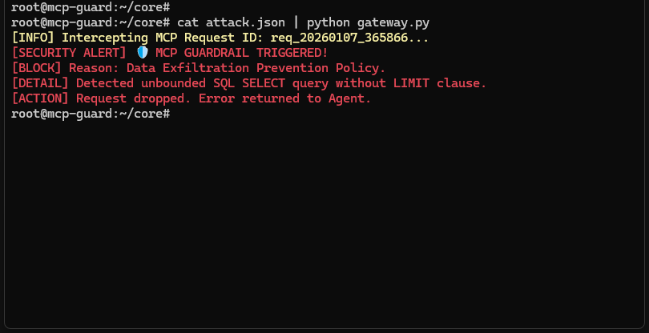

# 🛡️ MCP Sentinel: Runtime Security Gateway for Agentic AI

> **Your AI Agent is basically a Junior Developer with root access. Sentinel is the Supervisor.**

## 🚨 The Problem

We are entering the era of **Agentic AI**. Large Language Models (LLMs) are no longer just chatbox text generators; via the **Model Context Protocol (MCP)**, they now have "hands"—access to databases, APIs, file systems, and Slack channels.

Current security tools (LLM Firewalls, WAFs) focus on **Text & Semantics** (PII masking, toxicity, prompt injection).
They fail to address **Execution Logic**:

* What if an Agent enters an infinite loop calling a paid API?
* What if an Agent executes `SELECT *` on a production DB without a `LIMIT` clause?
* What if an Agent tries to pipe sensitive company data to a public domain?

**Standard firewalls see valid SQL syntax. Sentinel sees a Data Exfiltration attempt.**

## ⚡ The Solution

**MCP Sentinel** is a Man-in-the-Middle security layer that sits between your LLM Client (e.g., Claude Desktop, LangChain) and your MCP Servers (Tools).

It intercepts JSON-RPC messages in real-time to enforce **State & Logic Policies**.

### Key Features (v0.1 - Production Ready)
- ✅ **Deep Inspection:** Analyzes tool arguments, not just prompt text
- ✅ **Exfiltration Guard:** Detects and blocks unbounded queries (e.g., missing `LIMIT` in SQL)
- ✅ **Bidirectional Streaming:** Full MCP proxy with continuous JSON-RPC message forwarding
- ✅ **Subprocess Management:** Spawns and manages wrapped MCP servers
- ✅ **Audit Logging:** Structured JSON logs of all blocked requests to `security_audit.log`
- ✅ **Clean Output Separation:** JSON-RPC on stdout, colored logs on stderr
- 🛑 **Circuit Breaker:** (Roadmap) Stops infinite loops and excessive tool usage
- 🚦 **Human-in-the-Loop:** (Roadmap) Pauses execution for critical actions (DELETE/DROP) requiring approval

## 📸 Proof of Concept

*Sentinel blocking a simulated Data Exfiltration attempt where an Agent tried to dump a database without limits.*



## 🛠️ Quick Start

Sentinel works by piping standard input/output, acting as a transparent proxy for the MCP protocol.

### Demo Mode (Testing)

Test the security policy with a simulated attack:

```bash
# Simulating a data exfiltration attempt
cat attack.json | python3 gateway.py
```

**Expected output:**
- Colored security alerts to stderr
- JSON-RPC error response to stdout
- Entry logged to `security_audit.log`

### Proxy Mode (Production)

Use Sentinel as a wrapper for any MCP server in Claude Desktop.

**Configuration (`claude_desktop_config.json`):**

```json
{
  "mcpServers": {
    "sqlite-sentinel": {
      "command": "python3",
      "args": [
        "/absolute/path/to/gateway.py",
        "uvx",
        "sqlite-mcp",
        "--db-path",
        "/path/to/test.db"
      ]
    }
  }
}
```

**How it works:**
1. Claude Desktop launches `gateway.py` instead of `sqlite-mcp` directly
2. Gateway spawns `sqlite-mcp` as a subprocess
3. All JSON-RPC messages flow through gateway for validation
4. Dangerous requests are blocked, safe requests pass through
5. Security events logged to `security_audit.log`

## 🏗️ Architecture

```
┌─────────────────┐         ┌──────────────────┐         ┌─────────────────┐
│  Claude Desktop │◄───────►│  Gateway Process │◄───────►│   MCP Server    │
│    (Client)     │  stdio  │   (Sentinel)     │  stdio  │ (sqlite-mcp)    │
└─────────────────┘         └──────────────────┘         └─────────────────┘
                                     │
                                     ├─→ stderr (colored security logs)
                                     └─→ security_audit.log (structured JSON)
```

**Threading Model:**
- **Main thread:** Subprocess lifecycle management
- **Client→Server thread:** Reads from client stdin, validates tool calls, forwards to server
- **Server→Client thread:** Reads from server stdout, forwards to client (no validation)
- **Daemon thread:** Forwards server stderr for debugging

**Validation Logic:**
- Only `tools/call` messages are validated (initialization and other messages pass through)
- Current policy: Block `SELECT` queries without `LIMIT` clause
- Future: External policy configuration (YAML), OPA integration

## 📊 Audit Logging

All blocked requests are logged to `security_audit.log` in JSON Lines format:

```json
{
  "timestamp": "2026-01-13T10:11:36.279646",
  "message_id": "req_20260107_365866",
  "method": "tools/call",
  "reason": "Data Exfiltration Prevention",
  "details": {
    "jsonrpc": "2.0",
    "method": "tools/call",
    "params": {
      "name": "query_database",
      "arguments": {
        "query": "SELECT * FROM users_sensitive_data"
      }
    },
    "id": "req_20260107_365866"
  }
}
```

**Analyzing logs:**

```bash
# View all blocked requests
cat security_audit.log | jq .

# Count blocks by reason
cat security_audit.log | jq -r .reason | sort | uniq -c

# Find recent blocks
tail -n 10 security_audit.log | jq .
```

## 🔧 Troubleshooting

**Gateway doesn't block dangerous queries:**
- Ensure you're using newline-delimited JSON (not pretty-printed)
- Check that the message method is `tools/call`
- Verify the query is in the `arguments.query` field

**Subprocess not spawning:**
- Use full absolute paths in Claude Desktop config
- Check that the wrapped MCP server command is valid
- View stderr output for error messages

**Messages not forwarding:**
- Ensure proper line buffering (each JSON message must end with `\n`)
- Check that stdin/stdout are not being buffered by the shell
- Test with simple commands first (e.g., `cat`) before real MCP servers

## 🗺️ Roadmap

**v0.1 (Current) - Production-Ready Proxy** ✅
- [x] Python-based JSON-RPC Interceptor with threading
- [x] Subprocess management for wrapped MCP servers
- [x] Bidirectional streaming with clean output separation
- [x] Structured audit logging to JSON Lines format
- [x] Basic SQL exfiltration prevention policy

**v0.2 - Enhanced Configurability**
- [ ] External Policy Config (YAML) - Decoupling rules from code
- [ ] HTTP/SSE Transport Layer - Gateway as HTTP proxy for remote MCP servers
- [ ] Multiple policy profiles (development, staging, production)
- [ ] Policy hot-reload without restart

**v0.3 - Enterprise Features**
- [ ] OPA (Open Policy Agent) Integration for complex rules
- [ ] Circuit Breaker: Rate limiting and infinite loop detection
- [ ] Human-in-the-Loop: Approval workflow for critical actions (DELETE, DROP)
- [ ] Metrics endpoint (Prometheus format)

**v1.0 - Full Platform**
- [ ] Web-based Audit Logging Dashboard
- [ ] Multi-tenancy support
- [ ] Policy library marketplace
- [ ] Integration with SIEM tools

## 🤝 Collaboration & Pilot
I am building this in public to solve a specific problem: Safe adoption of Agentic AI in Enterprise environments.

I am looking for 3 Design Partners (CTOs / Architects) who are currently deploying MCP tools and want to test these guardrails.

### Contact me: https://www.linkedin.com/in/pawel-pisarski/
